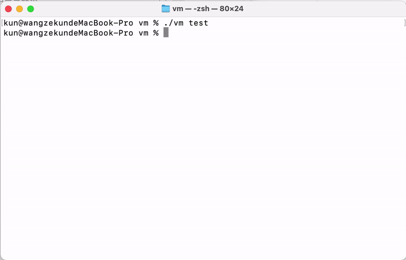

# VM
VM is, as its name suggests, a subset of Vim. It currently supports `i` `h` `j` `k` `l` `0` `$` `b` `w` `cc` `r` `o` `O` `s` `S` `x` `X` `dd` `D` `a` `A`.
# Demo

# Build
Run `make` at the project root directory.
# Known issues
Backspace is not properly captured as a special key on macOS; it works well on ubuntu.
